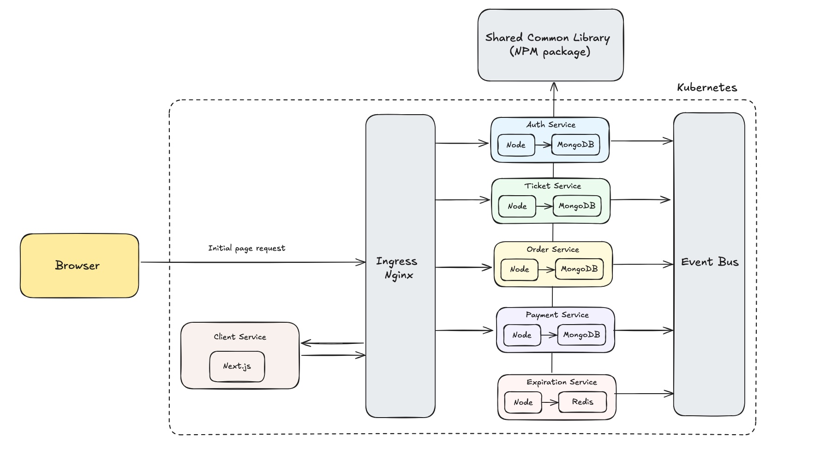

# Ticketeer
This is a full-stack ticketing platform built using Node.js, React (Next.js), MongoDB, Redis, Docker, and Kubernetes. It follows a microservices architecture and is designed for scalability, modularity, and resilience in a cloud-native environment.

## 🚀Features
This app enables users to:
- List tickets for events (concerts, sports, etc.)
- Browse and purchase available tickets
- Lock tickets during purchase to prevent double-booking
- Auto-expire unpaid orders within a configured time limit
- Handle secure credit card payments
- Edit ticket prices if the ticket is not locked

## 🧩Microservices Architecture
This application is built using a microservices approach. The system consists of five core services, and each service is independently deployed in Docker containers and orchestrated with Kubernetes. Services communicate asynchronously via an event bus to ensure decoupled, event-driven messaging. MongoDB is used as the database for persistent storage. Redis is used by the expiration service for managing order expiration.

The diagram below illustrates the overall architecture:

### Core Services
- auth: Handles user registration, login, and authentication
- tickets: Manages ticket creation, editing, and locking logic
- orders: Handles order creation, status updates, and association with tickets
- expiration: Monitors orders and cancels them after 15 minutes if unpaid
- payments: Processes Stripe payments and updates order status accordingly
### Core Components
- Client Service: Next.js frontend app
- Backend Services: Node.js microservices for tickets, orders, auth, payments, and expiration
- Event Bus: RabbitMQ for inter-service communication
- Databases: MongoDB for services, Redis for expiration service

## 💡Technical Highlights
### Shared Common Library
All services in the system share a centralized NPM package that encapsulates common logic to promote consistency and reduce duplication. This shared library includes standardized event type definitions for inter-service communication, custom error handling logic, and reusable middleware for authentication and request validation.
### Testing
To ensure code quality and reliability, each service is covered by a comprehensive testing setup. Unit tests written with Jest validate the core business logic and data models, while integration tests using Supertest verify API behavior and interactions with the database.
### CI/CD Pipeline
The project employs a CI/CD pipeline powered by GitHub Actions. Automated workflows run all tests on every pull request to catch regressions early, and successful merges to the main or staging branches trigger seamless deployments to the Kubernetes cluster.

## 🛠️Tech Stack
- Next.js (React)
- Node.js
- Express
- MongoDB
- Ingress Nginx
- Redis
- RabbitMQ
- Docker
- Kubernetes
- JWT-based
- Jest
- Supertest
- GitHub Actions

## 📦Getting Started
